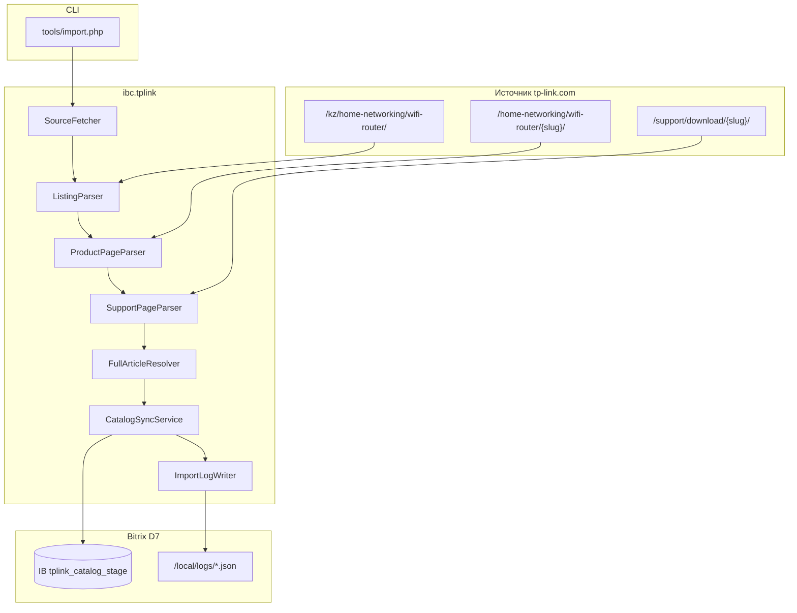

# Спецификация: модуль `ibc.tplink` (импорт каталога TP-Link)

**Версия спеки:** 1.0  
**Источник ТЗ:** v1.5 от 07.07.2026 — «Тестовое задание — Битрикс tp-link.ru»  
**Корень спеки:** `ibc/tplink/spec/`  
**Корень кода:** `local/modules/ibc.tplink/`  
**Эталоны IBC:** `ibc.license`, `ibc.work`, `ibc.avtoshop`

---

## 1. Цель и контекст

### 1.1. Бизнес-контекст

| Параметр | Значение |
|----------|----------|
| Сайт | https://tp-link.ru/ |
| Владелец | ООО «Современные технологии», официальный партнёр TP-Link |
| Стек прод | 1С-Битрикс Бизнес, PHP 8.3, шаблон Aspro Max |
| Проблема | Каталог устарел (~1,5 года), неполный; фильтры и характеристики в категории «Роутеры Wi‑Fi» не унифицированы |

### 1.2. Цель модуля (задача A)

Реализовать **воспроизводимый CLI-импорт** актуального списка моделей Wi‑Fi роутеров с официального каталога TP-Link в инфоблок Bitrix с:

- полным охватом категории на источнике;
- развёртыванием карточек по комбинациям **регион × HW-версия** (FULL_ARTICLE);
- идемпотентностью повторного запуска;
- структурированным JSON-логом и CSV-отчётами для сверки кандидатов.

### 1.3. Вне scope модуля (задача B)

Аудит фильтров и характеристик категории на tp-link.ru — **отдельный документ** [AUDIT_TASK.md](./AUDIT_TASK.md). Код модуля задачу B не реализует.

### 1.4. Ограничения среды

- Работа **локально / на тестовом хостинге**; прод tp-link.ru и 1С:УНФ **не трогаем**.
- Для задачи A **Aspro Max не требуется** — достаточно чистого Bitrix Бизнес + PHP 8.3 + MySQL.
- **Веб-точка входа импорта запрещена** — только CLI.

---

## 2. Архитектура



### 2.1. Почему модуль, а не `/local/tools/`

| Критерий | Модуль `ibc.tplink` | Одиночный скрипт |
|----------|---------------------|------------------|
| Создание IB при install | ✅ | вручную |
| Версионирование, DoUpdate | ✅ | ❌ |
| Переиспользование на tp-link.ru | ✅ | сложнее |
| Соответствие монорепо IBC | ✅ | частично |

**Решение:** код в `local/modules/ibc.tplink/`, точка входа `tools/import.php` (тонкая обёртка над prolog + `ImportService`).

---

## 3. Структура модуля

```
ibc/tplink/
├── spec/
│   ├── README.md
│   ├── MODULE_ASSIGNMENT.md          # этот документ
│   ├── AUDIT_TASK.md                 # задача B
│   ├── TZ_CHECKLIST.md
│   ├── TZ_EXTRACTED.txt
│   └── schemas/import-log.schema.json
└── (docx ТЗ в корне ibc/tplink/)

local/modules/ibc.tplink/
├── install/
│   ├── index.php                     # DoInstall / DoUpdate / DoUninstall
│   ├── version.php
│   └── IblockInstaller.php           # создание типа + IB + свойств
├── include.php
├── default_option.php
├── options.php                       # URL источника, таймауты, регион по умолчанию
├── lib/
│   ├── Service/
│   │   ├── ImportService.php         # оркестратор пайплайна
│   │   ├── SourceFetcher.php         # HTTP-клиент, retry, rate limit
│   │   ├── ListingParser.php         # A.1 — список карточек
│   │   ├── ProductPageParser.php     # A.2 — имя, ARTICLE, характеристики
│   │   ├── SupportPageParser.php     # A.4 — HW-версии, регионы из прошивок
│   │   ├── FullArticleResolver.php   # сбор FULL_ARTICLE, NEEDS_REVIEW
│   │   ├── CatalogSyncService.php    # upsert в IB, MISSING_AT_SOURCE
│   │   ├── ImportLogWriter.php       # JSON + CSV
│   │   └── HashCheckService.php      # sha256(sorted FULL_ARTICLE)
│   ├── Dto/
│   │   ├── SourceCardDto.php
│   │   ├── ProductVariantDto.php
│   │   └── SyncResultDto.php
│   └── Exception/
│       ├── ParseException.php
│       └── FetchException.php
├── tools/
│   └── import.php                      # единственная команда запуска
└── lang/ru/
```

**Не включать в MVP:** REST API, админ-UI, агент cron (можно добавить на этапе интеграции с tp-link.ru).

---

## 4. Источник данных

### 4.1. Списочная страница (этап A.1)

| Параметр | Значение |
|----------|----------|
| URL | `https://www.tp-link.com/kz/home-networking/wifi-router/` |
| Охват | Все модели после полной прокрутки/пагинации, **без активных фильтров** |
| На выходе | `SOURCE_URL`, `NAME` (как на списке, напр. «Archer AX72») |

Публичного API tp-link.com **нет**. Допустимые методы (на выбор реализации, зафиксировать в README):

- HTTP + HTML-парсинг (DOMDocument / Symfony DomCrawler);
- headless browser (Playwright/Puppeteer) — только если без него не обойти динамическую подгрузку;
- внутренние JSON endpoints сайта (если найдены и стабильны);
- `sitemap.xml` как вспомогательный индекс URL.

### 4.2. Карточка товара (этап A.2)

Пример: `/home-networking/wifi-router/archer-ax72/`

Извлекается:

- `NAME` → поле элемента IB;
- `ARTICLE` — базовое имя без суффиксов (напр. `Archer AX72`);
- `CATEGORY` — текст из хлебных крошек (напр. «Роутеры Wi‑Fi»);
- `WIFI_STANDARD`, `WIFI_SPEED`, `WAN_SPEED`, `LAN_PORTS` — если есть на странице.

**На карточке нет** региональных суффиксов и HW-ревизий — они берутся на support-странице.

### 4.3. Support / download (этап A.4)

URL: `/support/download/{model-slug}/` (slug = slug карточки)

Алгоритм FULL_ARTICLE:

1. Открыть карточку → имя модели.
2. Построить URL support-страницы.
3. Из дропдауна «Выберите версию оборудования» — список HW (V1, V2, V4…).
4. Из имён файлов прошивок — регион (напр. `Archer AX55(EU)_V4_251030` → EU, V4).
5. Сформировать `FULL_ARTICLE = "{model}({region}) {hw_version}"`, напр. `Archer AX55(EU) V4`.

**Правило «1 карточка = N элементов»:** для каждой комбинации (модель, регион, HW) — отдельный элемент IB; общий `SOURCE_URL`.

**Ориентир по объёму:** ~75 карточек на списке → **200–300 элементов** в IB. Если элементов ≈ числу карточек — HW×region не развёрнут (ошибка реализации).

---

## 5. Инфоблок (целевая структура)

Создаётся **программно при первом запуске / install**, если не существует.

| Параметр | Значение |
|----------|----------|
| Тип IB | `catalog` (предпочтительно) или `test_catalog` с обоснованием в README |
| Символьный код | `tplink_catalog_stage` |
| Название | TP-Link Catalog (Test Import) |

### 5.1. Свойства элементов

| CODE | Название | Тип | Обяз. | Примечание |
|------|----------|-----|-------|------------|
| `ARTICLE` | Артикул (базовый) | string | Y | `Archer AX72` |
| `FULL_ARTICLE` | Полный артикул | string | Y | **Ключ уникальности**, напр. `Archer AX72(EU) V1` |
| `CATEGORY` | Категория | string | Y | Из хлебных крошек источника |
| `WIFI_STANDARD` | Wi‑Fi стандарт | string | N | напр. Wi‑Fi 6 (802.11ax) |
| `WIFI_SPEED` | Скорость Wi‑Fi | string | N | Как на источнике |
| `WAN_SPEED` | Скорость WAN | string | N | |
| `LAN_PORTS` | LAN-порты | number | N | |
| `SOURCE_URL` | URL карточки | string | Y | **Не** ключ уникальности |
| `SYNCED_AT` | Время синхронизации | string | Y | ISO 8601 |
| `MISSING_AT_SOURCE` | Нет на источнике | list Y/N | Y | default N |
| `NEEDS_REVIEW` | Требует ручной проверки | list Y/N | Y | default N |

Поле **NAME** элемента = человекочитаемое имя модели с списка/карточки.

### 5.2. Цена

На tp-link.com цен **нет**. Импортёр **не изменяет** `PRICE` / торговый каталог. Замечания о `0 ₽` на tp-link.ru — в отчёт задачи B, не в лог импорта как error.

### 5.3. HL-блоки (опционально)

Допустимо вынести справочник Wi‑Fi стандартов в HL — только с обоснованием в README. Для тестового ТЗ достаточно строковых свойств.

---

## 6. Идемпотентность и синхронизация

### 6.1. Ключ уникальности

**PRIMARY:** `FULL_ARTICLE`

**FALLBACK** (если FULL_ARTICLE не извлечён):

- `NEEDS_REVIEW = Y`;
- ключ `(NAME, SOURCE_URL)`;
- причина — в JSON-лог (`errors` / `items[].needs_review`).

`SOURCE_URL` в ключ **не входит** (смена slug не должна плодить дубли).

Примеры различных элементов: `Archer AX72` vs `Archer AX72 Pro`; `Archer AX55(EU) V1` vs `Archer AX55(EU) V4`.

### 6.2. Статусы при прогоне

| Ситуация | Действие | Статус в логе |
|----------|----------|---------------|
| Новый FULL_ARTICLE на источнике | `Add` элемент | `new` |
| Есть в IB, изменились поля | `Update` | `updated`, `MISSING_AT_SOURCE=N` |
| Есть в IB, поля те же | skip | `unchanged`, `MISSING_AT_SOURCE=N` |
| Был в IB, на источнике исчез | не удалять | `missing`, `MISSING_AT_SOURCE=Y` |
| Ошибка парсинга/сети для карточки | не падать целиком | `error` в `errors[]` |

Сравнение полей: все свойства из §5.1 + `NAME`.

### 6.3. Support-страница недоступна

- Один элемент с fallback-ключом;
- `NEEDS_REVIEW=Y`;
- явная запись в лог.

---

## 7. CLI и запуск

### 7.1. Команда (обязательная для сдачи ТЗ)

```bash
php -f local/modules/ibc.tplink/tools/import.php
```

Опциональные флаги (рекомендуется):

```bash
php -f local/modules/ibc.tplink/tools/import.php -- --dry-run
php -f local/modules/ibc.tplink/tools/import.php -- --csv=storage/tplink_import_run.csv
php -f local/modules/ibc.tplink/tools/import.php -- --source-url=https://www.tp-link.com/kz/home-networking/wifi-router/
```

### 7.2. Требования к скрипту

- Подключение `\Bitrix\Main\Loader`, prolog CLI (`DOCUMENT_ROOT` + `bitrix/modules/main/include/prolog_before.php`).
- **Запрет** вызова через веб (`php_sapi_name() === 'cli'`).
- Exit code: `0` — успех (даже при частичных errors), `1` — фatal (нет Bitrix, нет IB, нет сети к списку).

### 7.3. Зависимости

| Компонент | Минимум |
|-----------|---------|
| PHP | 8.3+ |
| Bitrix | Бизнес, D7 |
| Расширения | curl, dom, json, mbstring |
| Composer | опционально: `symfony/dom-crawler`, `symfony/http-client` |

---

## 8. Логирование и отчёты

### 8.1. JSON-лог

**Путь:** `/local/logs/tplink_import_YYYY-MM-DD_HH-MM-SS.json`

**Схема:** [schemas/import-log.schema.json](./schemas/import-log.schema.json)

```json
{
  "started_at": "2026-07-09T12:00:00+03:00",
  "finished_at": "2026-07-09T12:15:00+03:00",
  "source_url": "https://www.tp-link.com/kz/home-networking/wifi-router/",
  "counters": { "new": 210, "updated": 0, "unchanged": 0, "missing": 0, "errors": 2 },
  "items": [
    {
      "article": "Archer AX55(EU) V4",
      "full_article": "Archer AX55(EU) V4",
      "name": "Archer AX55",
      "status": "new",
      "url": "https://www.tp-link.com/.../archer-ax55/",
      "changed_fields": [],
      "needs_review": false
    }
  ],
  "errors": [],
  "hash_check": {
    "sorted_full_articles_sha256": "abc...",
    "card_count": 75,
    "element_count": 287
  }
}
```

### 8.2. CSV (для сдачи ТЗ)

| Файл | Когда |
|------|-------|
| `tplink_import_first_run.csv` | после 1-го запуска |
| `tplink_import_second_run.csv` | сразу после 2-го без изменений источника |

Колонки: `article`, `name`, `category`, `source_url`, `status`

### 8.3. Hash Check (README)

```
sha256(sorted_full_articles) = <hex>
```

SHA256 от списка **FULL_ARTICLE**, отсортированных лексикографически, joined `\n` (UTF-8).

---

## 9. Обработка ошибок

| Сценарий | Поведение |
|----------|-----------|
| Таймаут HTTP | retry 3× с backoff; затем `error` для URL, продолжить |
| HTTP 4xx/5xx на карточке | log + skip карточки |
| Изменилась вёрстка | `ParseException` с селектором; не падать на всём импорте |
| Нет FULL_ARTICLE | fallback + `NEEDS_REVIEW=Y` |
| Нет сети к списку | exit 1, без partial IB update (или только missing — зафиксировать в README) |

---

## 10. Установка модуля (`install/index.php`)

### 10.1. DoInstall

1. RegisterModule(`ibc.tplink`).
2. `IblockInstaller::ensureCatalog()` — тип (если нужен), IB `tplink_catalog_stage`, все свойства §5.1.
3. Создать `/local/logs/` если нет (или проверка прав записи).
4. Default options: source URL, user-agent, timeout.

### 10.2. DoUpdate

- Миграции: новые свойства IB, индексы.
- Версия в `install/version.php`.

### 10.3. DoUninstall

- Опция: удалять IB (`uninstall_delete_ib=N` по умолчанию — **не удалять** данные теста).

---

## 11. README репозитория (обязательные разделы)

Соответствует ТЗ A.6:

1. Развёртывание на чистом Bitrix (git clone → install → первый запуск).
2. Зависимости.
3. Одна команда запуска.
4. Ограничения текущей реализации.
5. Что сделали бы за +4 часа.
6. Обоснование архитектуры (модуль vs tools, парсинг, IB vs HL).
7. **## Hash Check** — строка sha256.
8. Использование ИИ (5–10 строк).

---

## 12. Критерии приёмки (задача A)

| # | Критерий |
|---|----------|
| 1 | Все модели категории собраны; `sha256` совпадает с эталоном заказчика |
| 2 | 2-й запуск → все `unchanged` |
| 3 | `MISSING_AT_SOURCE` при исчезновении с источника |
| 4 | Устойчивость к сетевым/парсинг ошибкам |
| 5 | Код структурирован (parser / sync / log отдельно) |
| 6 | JSON-лог по схеме |
| 7 | Запуск одной командой без ручных правок |
| 8 | Элементов IB >> числа карточек (HW×region) |

---

## 13. Дальнейшее развитие (после тестового ТЗ)

Не входит в MVP, но закладывается архитектурно:

| Этап | Содержание |
|------|------------|
| Интеграция tp-link.ru | Маппинг `tplink_catalog_stage` → боевой каталог Aspro, синхронизация свойств из [AUDIT_TASK.md](./AUDIT_TASK.md) §B.3 |
| Cron | `\Bitrix\Main\Agent` или server cron → еженедельный импорт |
| Omada / multi-brand | см. AUDIT B.6 |
| Поиск по латинским артикулам | см. AUDIT B.7 |
| 1С:УНФ | цены и остатки — отдельный обмен, не tp-link.com |

---

## 14. Связанные документы

- [AUDIT_TASK.md](./AUDIT_TASK.md) — задача B (фильтры, характеристики, оценка часов).
- [TZ_CHECKLIST.md](./TZ_CHECKLIST.md) — трассировка пунктов docx → модуль.
- [TZ_EXTRACTED.txt](./TZ_EXTRACTED.txt) — полный текст ТЗ v1.5.
