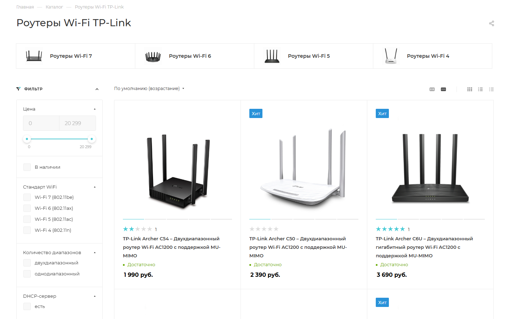
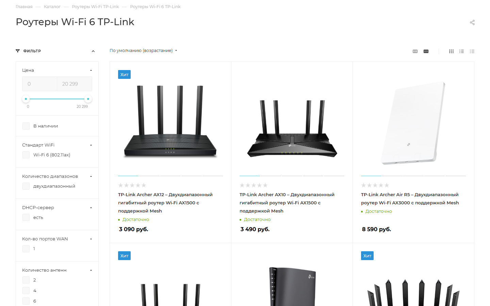
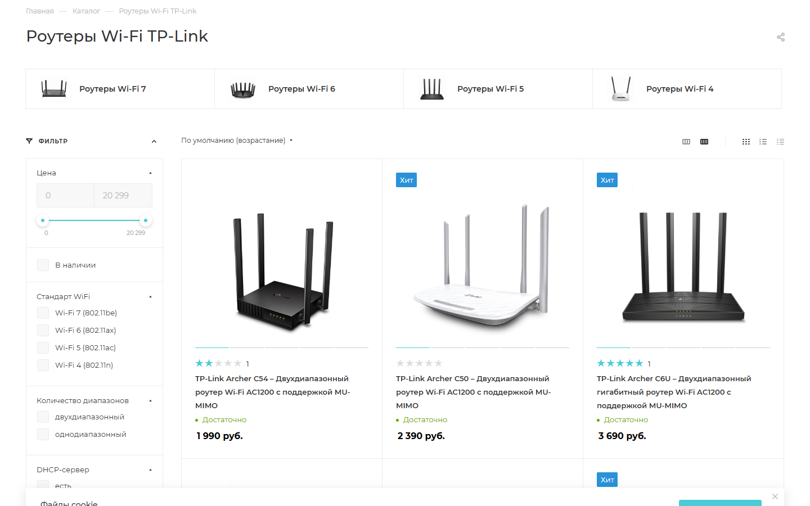
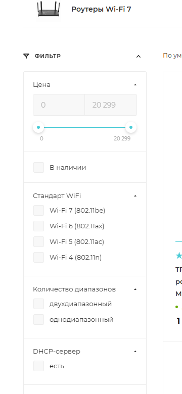
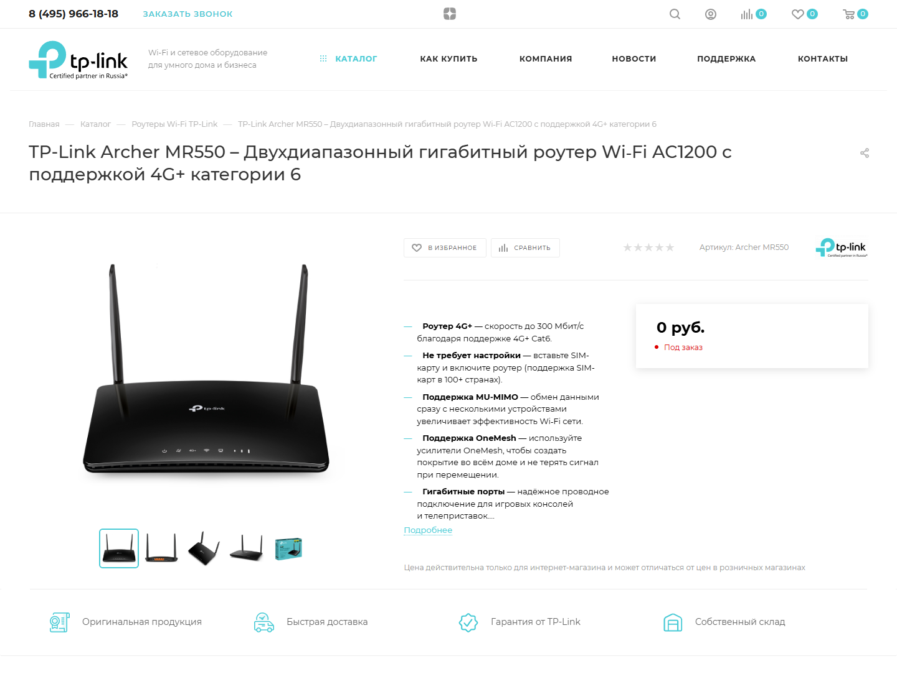
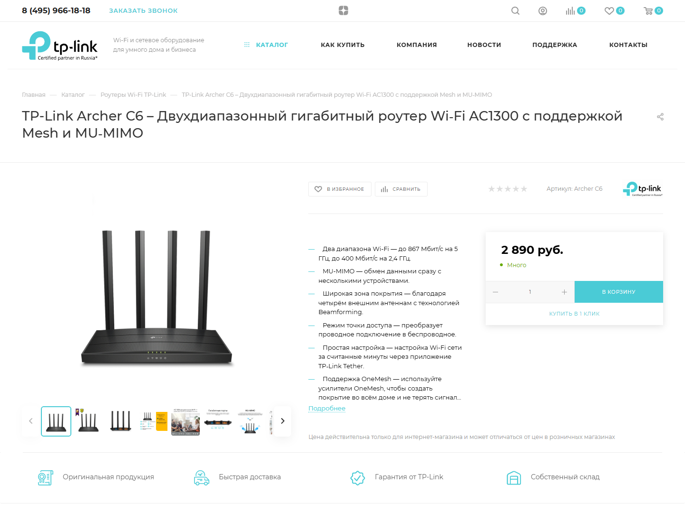
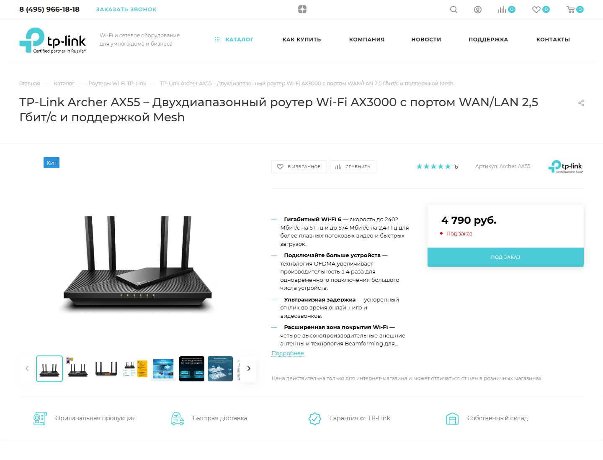
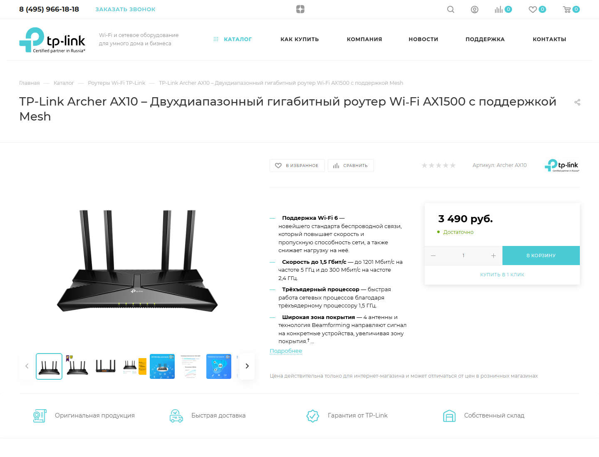
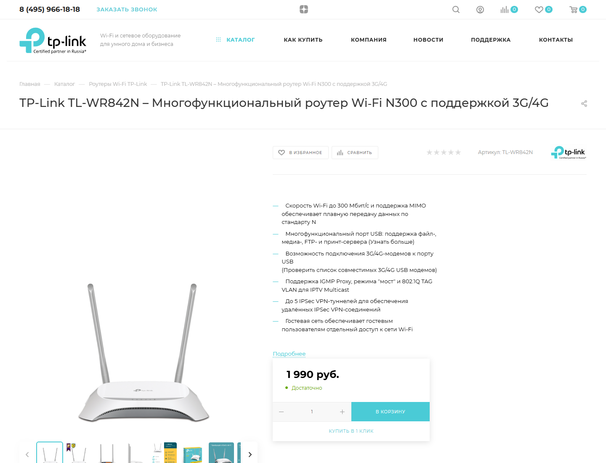

# Аудит: Роутеры Wi‑Fi (tp-link.ru)

**Дата:** 2026-07-11  
**Категория:** [Роутеры Wi‑Fi TP-Link](https://tp-link.ru/catalog/routery-wi-fi/)  
**Платформа:** Bitrix + шаблон Aspro Max (`catalog.smart.filter`, `main_ajax`)  
**Связанный импортёр (задача A):** `ibc.tplink` → эталон tp-link.com/kz

---

## B.1. Фильтры

### Контекст

Категория «Роутеры Wi‑Fi» использует **два параллельных механизма** отбора по поколению Wi‑Fi:

1. **Подразделы** в шапке листинга: `/wi-fi-7/`, `/wi-fi-6/`, `/wi-fi-5/`, `/wi-fi-4/`.
2. **Умный фильтр** (слева): свойство «Стандарт WiFi» с теми же значениями (802.11be/ax/ac/n).

Остальные параметры фильтра (Aspro `catalog.smart.filter`, property_id из HTML): цена, «В наличии», количество диапазонов, DHCP-сервер (id 1796), WAN-порты, количество антенн (id 1799), VPN, скорость Wi‑Fi, скорость WAN.

---

### Проблема 1 — фильтр «Wi‑Fi 6» не сужает выдачу (критично)

**URL:**  
https://tp-link.ru/catalog/routery-wi-fi/filter/standart-wifi-is-wi-fi-6-802-11ax/apply/

**Ожидание:** только модели AX* / 802.11ax.  
**Факт:** в первой строке выдачи остаются **Archer C54, C50, C6U** — в названии **AC1200** (Wi‑Fi 5 / 802.11ac), плюс на общей странице — **TL‑WR840N** (N300 / Wi‑Fi 4).

**Сравнение:** подраздел  
https://tp-link.ru/catalog/routery-wi-fi/wi-fi-6/  
корректно показывает только AX‑линейку (AX10, AX12, AX55, …).

**Вывод:** SEO‑URL фильтра и подразделы **не эквивалентны**. Свойство «Стандарт WiFi» в умном фильтре либо не привязано к элементам, либо не участвует в `CIBlockElement::GetList` при SEF‑фильтрации. Пользователь, отметивший «Wi‑Fi 6» в боковом фильтре, получает **ту же смешанную выдачу**, что и без фильтра.

  
*Рис. 1 — SEF‑URL с `standart-wifi-is-wi-fi-6`, в листинге Archer C54/C50/C6U (AC1200).*

  
*Рис. 2 — подраздел `/wi-fi-6/` отрабатывает корректно (эталон поведения).*

**Рекомендация:** выбрать **один** канал (подраздел **или** фильтр), второй синхронизировать; проверить заполнение свойства «Стандарт WiFi» у всех SKU и настройки умного фильтра Aspro (тип свойства, индексация, участие в `FILTER`.

---

### Проблема 2 — дублирование навигации Wi‑Fi 4/5/6/7

На странице одновременно:

- 4 плитки‑подраздела («Роутеры Wi‑Fi 7» … «Wi‑Fi 4»);
- блок «Стандарт WiFi» с теми же смысловыми значениями.

Пользователь не понимает, чем отличаются клик по плитке и чекбокс в фильтре (особенно после проблемы 1, когда результат **разный**).

  
*Рис. 3 — двойная ось «поколение Wi‑Fi»: подразделы сверху и «Стандарт WiFi» слева.*

**Рекомендация:** оставить подразделы для SEO и навигации, в фильтре — производные оси (скорость, WAN 2.5G, Mesh, VPN) **без** дублирования поколения; либо при выборе подраздела автоматически проставлять чекбокс фильтра (и наоборот).

---

### Проблема 3 — «мёртвые» и одно значение фильтры

На родительской категории часть осей не помогает выбору:

| Фильтр | Значения на сайте | Замечание |
|--------|-------------------|-----------|
| DHCP‑сервер | только «есть» | нет «нет» → фильтр не отсекает |
| Кол‑во портов WAN | только «1» | единственное значение → бесполезен |
| Поддержка VPN | только «есть» | аналогично |
| Количество антенн | 1, 2, 3, 4, **6**, **5** | порядок **6 → 5** (сортировка enum не по числу) |

  
*Рис. 4 — однозначные фильтры (DHCP «есть», WAN «1») и неверный порядок «Количество антенн».*

**Рекомендация:** скрывать в UI свойства с ≤1 значением; для числовых enum — сортировка `SORT`/`VALUE` по числу; для boolean — всегда «да/нет».

---

### Проблема 4 — пересекающиеся корзины «Скорость WiFi»

Диапазоны:

- «150–1350 Мбит/с»
- «Больше 1350 Мбит/с»
- «Больше 3000 Мбит/с»

Границы не документированы на UI; модель **AX3000** формально попадает и во «>1350», и во «>3000» (маркeting aggregate ≠ одна цифра). Это создаёт путаницу при комбинировании фильтров.

**Рекомендация:** перейти на непересекающиеся интервалы или одно числовое свойство «max_wifi_speed_mbps» с ползунком.

---

### Проблема 5 — смешение типов устройств в одной выдаче

В общем списке «Роутеры Wi‑Fi» вперемешку:

- классические домашние роутеры (Archer C*);
- **4G/LTE** (TL‑MR100, TL‑MR3020, Archer MR*);
- **портативные** (TL‑WR902AC);
- **VDSL** (Archer VR400).

При этом в меню есть отдельные разделы «Портативный Wi‑Fi», «Маршрутизаторы». Фильтр **не даёт** отсечь LTE/VDSL/Portable — только ручной просмотр.

**Рекомендация:** свойство «Тип устройства» (router / lte / portable / vdsl) + фильтр или вынос в дочерние разделы с редиректом карточек.

---

### Проблема 6 — дубликат карточки в листинге

На странице 1 родительской категории **TP‑Link TL‑WR842N** встречается **дважды** подряд (один артикул, одна цена 1 990 ₽). Вероятная причина — дублирующиеся элементы IB или двойная привязка к разделу без дедупликации в компоненте каталога.

**Рекомендация:** аудит элементов с `ARTICLE = TL-WR842N` в IB; уникальность по `FULL_ARTICLE` / торговому SKU как в задаче A.

---

### Проблема 7 — несогласованность подраздела Wi‑Fi 6 и маркетинговых названий

В подразделе `/wi-fi-6/` присутствуют **Archer MR500 / MR550 / MR600** — в заголовке указано **«Wi‑Fi AC1200»** (802.11ac, Wi‑Fi 5), не ax. Они попали в подраздел Wi‑Fi 6, вероятно, из‑за маркетингового текста «4G+ категории 6» (LTE Cat 6 ≠ Wi‑Fi 6).

**Рекомендация:** развести свойства `WIFI_STANDARD` и `LTE_CATEGORY`; подразделы строить только по `WIFI_STANDARD`.

---

### Сводка приоритетов (B.1)

| Приоритет | Проблема | Влияние |
|-----------|----------|---------|
| P0 | Фильтр «Стандарт WiFi» не работает (рис. 1–2) | пользователь не может отобрать Wi‑Fi 6 |
| P1 | Дубли подраздел / фильтр | UX, SEO cannibalization |
| P1 | MR* в подразделе Wi‑Fi 6 | неверная классификация |
| P2 | Мёртвые фильтры, порядок антенн | шум в UI |
| P2 | Пересечение скоростей | ложные комбинации |
| P3 | Смешение LTE/portable/VDSL | сложный выбор |
| P3 | Дубликат TL‑WR842N | доверие к каталогу |

---

## B.2. Характеристики карточек

### Контекст

Характеристики на tp-link.ru — вкладка **«Характеристики»** (таблица свойств IB) + маркетинговый блок над ней (bullets, SEO‑текст, виджет «Подходит ли Вам …»).  
Для фильтров Aspro (см. B.1) используются **те же** поля IB — ошибки в карточках напрямую ломают умный фильтр.

Ниже **6 примеров** с URL и скринами (2026‑07‑11).

---

### Пример 1 — цена 0 ₽ при активной карточке

**URL:** [Archer MR550](https://tp-link.ru/catalog/routery-wi-fi/archer-mr550/)

| Где | Значение |
|-----|----------|
| Цена | **0 ₽** |
| Кнопка | «Под заказ» (без нормальной витрины) |
| Артикул | Archer MR550 |

**Проблема:** товар участвует в каталоге и фильтрах, но **не имеет retail‑цены**. Пользователь не может сравнить по цене; в выгрузках 1С/маркетплейсов — риск нулевой цены.  
**Класс:** устаревший / не поддерживаемый SKU без снятия с публикации.


*Рис. B2‑1 — нулевая цена на опубликованной карточке.*

**Аналоги:** [Archer AX5400](https://tp-link.ru/catalog/routery-wi-fi/archer-ax5400/), Archer AX18, AX1500, AX1800, AX58, AX3000 — также **0 ₽** в листинге Wi‑Fi 6.

---

### Пример 2 — противоречие «Wi‑Fi 6» в IB vs AC1200 в названии

**URL:** [Archer MR550](https://tp-link.ru/catalog/routery-wi-fi/archer-mr550/)

| Источник | Значение |
|----------|----------|
| H1 / описание | **AC1200**, «Wi Fi AC1200», LTE Cat **6** |
| Таб «Характеристики» → **Стандарт WiFi** | **Wi‑Fi 6 (802.11ax)** |
| Скорости в таблице | 802.11n/ac (300 + 866), max **1167** |

**Проблема:** в одной карточке смешаны **маркетинговое AC1200**, **LTE Cat 6** и ошибочно проставленный **802.11ax**. Поле «Стандарт WiFi» попадает в умный фильтр → модель оказывается в подразделе Wi‑Fi 6 (см. B.1) и в фильтре ax, хотя это **4G‑роутер Wi‑Fi 5**.

**Корневая причина (гипотеза):** copy‑paste значений enum / автогенерация SEO без валидации; путаница «Cat 6» ↔ «Wi‑Fi 6».



*Рис. B2‑2 — расхождение названия и поля «Стандарт WiFi».*

---

### Пример 3 — три разных «скорости» на одной карточке (Archer C6)

**URL:** [Archer C6](https://tp-link.ru/catalog/routery-wi-fi/archer-c6/)

| Место | Обозначение скорости |
|-------|----------------------|
| Заголовок H1 | **AC1300** |
| Bullets над табом | 867 + 400 Мбит/с |
| SEO‑текст | **AC750**, 300 + 450 Мбит/с |
| Таб «Характеристики» | 802.11n 300 + 802.11ac **867** (без суммарного поля max) |

**Проблема:** покупатель видит **AC1300, AC750 и 867/400** одновременно; единицы не нормализованы (класс AC vs сумма диапазонов). Поле «Скорость WiFi» в фильтре (корзины 150–1350 / >1350) **не может** однозначно мапиться на эти цифры.



*Рис. B2‑3 — несколько несовместимых speed‑label на одной карточке.*

---

### Пример 4 — ключевой USP есть в тексте, но нет в таблице свойств

**URL:** [Archer AX55](https://tp-link.ru/catalog/routery-wi-fi/archer-ax55/)

| USP в названии / SEO | **WAN/LAN 2,5 Гбит/с** |
| Таб «Характеристики» → порты | только «Количество выходных портов **10/100/1000BASE-TX**: 4» |
| Поле «Максимальная скорость порта WAN» | **отсутствует** (не заполнено → не фильтруется) |

Дополнительно: **Оперативная память: 512** — без единицы (MB?); **Максимальная скорость WiFi: 2976** при маркетинговом **AX3000** (3000).

**Проблема:** фильтр «Максимальная скорость порта WAN → 2500 Мбит/с» (B.1) **не находит** AX55, хотя 2,5G — главный аргумент карточки.



*Рис. B2‑4 — USP 2,5G только в маркетинге, не в IB.*

---

### Пример 5 — aggregate WiFi: marketing class вместо суммы диапазонов

**A) [Archer AX10](https://tp-link.ru/catalog/routery-wi-fi/archer-ax10/)**

| Маркетинг | **AX1500** (300 + 1200 Мбит/с) |
| Таблица | 802.11ax 5G = **1201**; поле «Максимальная скорость по всем WiFi диапазонам» = **1201** |
| Пропуск | скорость **802.11ax 2.4 ГГц** не участвует в aggregate |

**B) [Archer AX5400](https://tp-link.ru/catalog/routery-wi-fi/archer-ax5400/)

| Диапазоны | 574 + 1201 = **1775** Мбит/с |
| Поле «Максимальная скорость…» | **5400** (= маркетинговый класс AX5400, а не сумма) |

**Проблема:** одно поле IB используется то как **сумма PHY‑rate**, то как **брендовое AXxxxx** → фильтр «Больше 3000 Мбит/с» и сравнение карточек некорректны.



*Рис. B2‑5 — aggregate 1201 при заявленных 1500 Мбит/с.*

---

### Пример 6 — мусорные / неверные блоки свойств (TL‑WR842N)

**URL:** [TL‑WR842N](https://tp-link.ru/catalog/routery-wi-fi/tl-wr842n/)

| Наблюдение | Деталь |
|------------|--------|
| Виджет «Подходит ли Вам» | **Число устройств: до 1** — явно неверно для роутера |
| Секция **ADSL** | «Дальность беспроводной связи 50–70» — у модели **нет ADSL**, блок из шаблона другой категории |
| Числовые поля | Частота CPU **580**, RAM **64**, Flash **8** — **без единиц** (MHz/MB) |
| Дубль в листинге | та же модель **дважды** на стр. 1 категории (см. B.1) |

**Проблема:** шаблон характеристик Aspro не сегментирован по типу устройства; «пустые» группы не скрываются.



*Рис. B2‑6 — шаблонные/битые поля на legacy‑карточке.*

---

### Сводка классов проблем (B.2)

| Класс | Примеры | Влияние |
|-------|---------|---------|
| Цена 0 ₽ | MR550, AX5400 | SEO, сравнение, фиды |
| Противоречивый Wi‑Fi standard | MR550 | фильтр Wi‑Fi 6, подразделы |
| Разные speed labels | C6, AX10, AX5400 | фильтр «Скорость WiFi», доверие |
| USP не в IB | AX55 (2,5G WAN) | фильтр WAN 2500 |
| Нет единиц измерения | WR842N, AX55 (RAM) | автоматизация, импорт |
| Шаблонный мусор | WR842N (ADSL) | UX, качество данных |
| Дубли SKU | WR842N в листинге | индекс каталога |

**Связь с задачей A:** импортёр `ibc.tplink` берёт этalon с tp-link.com; при интеграции с боевым IB нужен **маппинг + валидация** (FULL_ARTICLE, WIFI_STANDARD, WAN_SPEED) перед merge в Aspro.

---

## B.3. Модель свойств

### Принципы

1. **Один смысл — одно свойство — один CODE.** Не дублировать «поколение Wi‑Fi» подразделами и фильтром (B.1).
2. **Числа — числа с единицей в названии** (`_MBPS`, `_MHZ`), не смешивать marketing‑класс (AX3000) и PHY‑rate (B.2).
3. **Enum только с ≥2 значениями в категории** — иначе свойство не выводить в фильтр (DHCP «есть», WAN «1»).
4. **Развести LTE Cat и Wi‑Fi** — отдельные поля (MR550, B.2).
5. **Цена и остатки** — только **1С:УНФ**; эталон tp-link.com не содержит price (MODULE §5.2).

Ниже — целевая модель для IB каталога Aspro «Роутеры Wi‑Fi». Поля импортёра `ibc.tplink` (stage) помечены **→ A**.

---

### Таблица свойств (17)

| CODE | Название на сайте | Тип | Обяз. | В фильтре | Источник данных | Комментарий |
|------|-------------------|-----|-------|-----------|-----------------|-------------|
| `FULL_ARTICLE` | Полный артикул (скрыто) | строка | Y | N | автоимпорт tp-link.com **→ A** | Ключ уникальности: `Archer AX55(EU) V4`. Для вариантов EU/RU в одном `ARTICLE`. |
| `ARTICLE` | Артикул | строка | Y | Y | автоимпорт tp-link.com **→ A** | Базовая модель для поиска и латиницы (B.7): `Archer AX55`. |
| `DEVICE_TYPE` | Тип устройства | список | Y | Y | вручную + правила | `router` / `lte_cpe` / `portable` / `vdsl_modem`. Убирает LTE и TL‑MR* из «обычных» роутеров (B.1). |
| `WIFI_STANDARD` | Стандарт Wi‑Fi | список | Y | Y | автоимпорт tp-link.com **→ A** | Enum: `802.11n` / `802.11ac` / `802.11ax` / `802.11be`. **Не** LTE Cat 6. Заменяет путаный «Стандарт WiFi». |
| `WIFI_BANDS` | Количество диапазонов | список | Y | Y | автоимпорт / вручную | `single` / `dual`. Соответствует текущему фильтру «одно/двухдиапазонный». |
| `WIFI_SPEED_TOTAL_MBPS` | Суммарная скорость Wi‑Fi | число | Y | Y | автоимпорт tp-link.com | Сумма max PHY по активным диапазонам (Мбит/с). **Не** AX5400 как число 5400 (B.2). Диапазоны фильтра: &lt;1500, 1500–3000, &gt;3000. |
| `WIFI_SPEED_2G_MBPS` | Скорость 2,4 ГГц | число | N | N | автоимпорт tp-link.com | Детализация для карточки; опционально в compare. |
| `WIFI_SPEED_5G_MBPS` | Скорость 5 ГГц | число | N | N | автоимпорт tp-link.com | То же. |
| `WAN_PORT_SPEED_MBPS` | Скорость порта WAN | список | Y | Y | автоимпорт + вручную | Enum: 100 / 1000 / 2500 / 10000. Закрывает кейс AX55 2,5G (B.2). Заменяет «Максимальная скорость порта WAN». |
| `LAN_PORTS_COUNT` | LAN‑порты | число | N | Y | автоимпорт tp-link.com **→ A** | Количество RJ45 LAN. Только если &gt;0 и есть разброс значений. |
| `MESH_SUPPORT` | Поддержка Mesh | список | N | Y | автоимпорт / вручную | `none` / `onemesh` / `easymesh`. Заменяет «Поддержка технологии MESH» да/нет. |
| `VPN_SUPPORT` | Поддержка VPN | список | N | Y | автоимпорт / вручную | `Y` / `N` — **оба** значения обязательны для показа в фильтре. |
| `ANTENNA_COUNT` | Количество антенн | число | N | Y | автоимпорт / вручную | Сортировка 1…6 по числу. Исправляет порядок 6→5 (B.1). |
| `LTE_CATEGORY` | Категория LTE | число | N | Y | вручную | Только для `DEVICE_TYPE=lte_cpe` (Cat 4/6/…). **Не** путать с Wi‑Fi 6. |
| `SOURCE_URL` | Страница источника | строка | Y | N | автоимпорт tp-link.com **→ A** | URL kz/en spec; служебное, не в фильтре. |
| `NEEDS_REVIEW` | Требует проверки | список | Y | N | автоимпорт **→ A** | Y/N — fallback‑варианты без HW×region. |
| `PRICE` | Цена | число | Y | Y | **1С:УНФ** | Retail; карточки с 0 ₽ — снять с публикации или «по запросу» (B.2). Импортёр A не пишет. |

*Примечание:* служебные `SYNCED_AT`, `MISSING_AT_SOURCE` — только stage IB (`tplink_catalog_stage`), в боевой витрине не показывать.

---

### Маппинг: текущий tp-link.ru → целевая модель

| Сейчас на tp-link.ru | Проблема (B.1–B.2) | Целевой CODE |
|----------------------|--------------------|--------------|
| Стандарт WiFi | неверные значения (MR550) | `WIFI_STANDARD` |
| Количество диапазонов | OK | `WIFI_BANDS` |
| Скорость WiFi (корзины) | пересечения, AX‑class в числе | `WIFI_SPEED_TOTAL_MBPS` |
| Максимальная скорость порта WAN | не заполнено у AX55 | `WAN_PORT_SPEED_MBPS` |
| Количество антенн | порядок enum | `ANTENNA_COUNT` |
| Поддержка технологии MESH | только «есть» | `MESH_SUPPORT` |
| DHCP-сервер | одно значение | **убрать из фильтра** |
| Кол-во портов WAN = 1 | одно значение | **убрать** или заменить на `WAN_PORT_SPEED_MBPS` |
| Подразделы Wi‑Fi 4/5/6/7 | дубль фильтра | **навигация SEO**, данные из `WIFI_STANDARD` |
| SEO AC1300 / AC750 / AX3000 | разные labels | только в **NAME**/описании; в IB — числа |

---

### Маппинг: импортёр `ibc.tplink` (задача A) → боевой каталог

| Stage (`tplink_catalog_stage`) | Боевой IB | Трансформация |
|--------------------------------|-----------|---------------|
| `FULL_ARTICLE` | `FULL_ARTICLE` | 1:1 |
| `ARTICLE` | `ARTICLE` | 1:1 |
| `CATEGORY` | — | фикс. «Роутеры Wi‑Fi», не свойство элемента |
| `WIFI_STANDARD` | `WIFI_STANDARD` | нормализация в enum (802.11ax, не «Wi‑Fi 6» текстом) |
| `WIFI_SPEED` | `WIFI_SPEED_TOTAL_MBPS` | парсинг числа Мбит/с, сумма диапазонов |
| `WAN_SPEED` | `WAN_PORT_SPEED_MBPS` | 1000 → 2500 и т.д. |
| `LAN_PORTS` | `LAN_PORTS_COUNT` | 1:1 |
| `SOURCE_URL` | `SOURCE_URL` | 1:1 |
| `NEEDS_REVIEW=Y` | карточка не публикуется / черновик | ручная модерация |
| — | `DEVICE_TYPE` | правило: slug содержит `mr`, `lte` → lte_cpe |
| — | `PRICE` | только 1С после привязки SKU |

---

### Рекомендации по внедрению

1. **Создать новый тип свойств** (или мигрировать существующие) с XML_ID enum до импорта данных.
2. **Валидация при сохранении:** `WIFI_STANDARD=802.11ax` ⇒ суммарная скорость ≥ 1000; `LTE_CATEGORY` заполнен ⇒ `DEVICE_TYPE=lte_cpe`.
3. **Умный фильтр Aspro:** только свойства из таблицы с «В фильтре = Y» и ≥2 фактических значений в разделе.
4. **Подразделы Wi‑Fi N** генерировать автоматически по `WIFI_STANDARD`, без ручного дубля.

## B.4. Оценка трудозатрат

### Объём и допущения

| Параметр | Значение |
|----------|----------|
| Категория | [Роутеры Wi‑Fi](https://tp-link.ru/catalog/routery-wi-fi/) (~3 страницы листинга) |
| Оценка SKU в IB | **80–120** опубликованных элементов (без учёта скрытых «под заказ» / 0 ₽) |
| Целевая модель | B.3 (17 свойств) |
| Стек | Bitrix + Aspro Max, умный фильтр `catalog.smart.filter` |
| Вне scope | переписывание SEO‑текстов, интеграция 1С (кроме привязки цены), задача A (импортёр уже есть) |

Оценка дана для **одного middle+ Bitrix/Aspro** разработчика + **4–8 ч** контент/каталог‑менеджера на выборочную проверку.

---

### Этап 1 — миграция и нормализация данных в IB

| Работа | Часы | Комментарий |
|--------|------|-------------|
| Создание/переименование свойств IB по B.3 (enum, XML_ID, единицы) | 8–12 | `WIFI_STANDARD`, `WAN_PORT_SPEED_MBPS`, `DEVICE_TYPE` и др. |
| Скрипт маппинга старых полей → новые + прогон на копии стенда | 12–16 | «Стандарт WiFi» → enum; aggregate speed из полей 802.11n/ac/ax |
| Массовая правка P0: Wi‑Fi standard (MR550 и аналоги), 0 ₽ → снятие/«по запросу» | 6–10 | ~10–15 карточек |
| Классификация `DEVICE_TYPE` (LTE, portable, VDSL) + перенос в подразделы | 8–12 | TL‑MR*, Archer VR*, MR* |
| Дедупликация (TL‑WR842N и др.), привязка `FULL_ARTICLE` / варианты EU/RU | 6–8 | связка с логикой задачи A |
| Валидация: обязательные поля, правила B.3 (LTE ≠ Wi‑Fi 6) | 4–6 | обработчик OnBeforeIBlockElementUpdate или CSV‑отчёт |
| **Итого этап 1** | **44–64** | |

---

### Этап 2 — перенастройка умного фильтра Aspro

| Работа | Часы | Комментарий |
|--------|------|-------------|
| Удалить/скрыть «мёртвые» оси (DHCP, WAN=1, VPN только «есть») | 2–3 | B.1 |
| Починить фильтрацию по `WIFI_STANDARD` (SEF `/filter/.../apply/`) | 6–10 | P0: сейчас не сужает выдачу |
| Настроить оси B.3: speed, WAN Mbps, Mesh, антенны (сортировка) | 4–6 | |
| Согласовать подразделы `/wi-fi-N/` с данными IB (без ручного рассинхрона) | 4–6 | SEO‑плитки ↔ свойство |
| AJAX/мобильный фильтр, smoke на 5 комбинациях | 3–4 | |
| **Итого этап 2** | **19–29** | |

---

### Этап 3 — выборочная перепроверка карточек

| Объём | Часы | Комментарий |
|-------|------|-------------|
| **30 карточек** (≈30% каталога, stratified: Wi‑Fi 4/5/6, LTE, 0 ₽) | 8–10 | ~15–20 мин/карточка: таб «Характеристики» vs витрина |
| **10 карточек** углублённо (AX55, MR550, C6, AX10, WR842N + 5 случайных) | 4–5 | эталон после миграции |
| Регресс compare / похожие товары | 2–3 | |
| **Итого этап 3** | **14–18** | при полной проверке всех 100+ SKU: **+24–32 ч** |

---

### Этап 4 — регрессия SEO / URL

| Работа | Часы | Комментарий |
|--------|------|-------------|
| Проверка ЧПУ подразделов, canonical, хлебные крошки | 3–4 | |
| SEF умного фильтра: индексация, noindex при необходимости | 4–6 | |
| `SEARCH_INDEX` / переиндексация после смены свойств | 2–3 | пересечение с B.7 |
| Smoke: title/H1 не противоречат IB (AC1300 vs AC750) | 3–4 | выборочно топ‑20 URL |
| **Итого этап 4** | **12–17** | |

---

### Сводка

| Этап | Мин., ч | Макс., ч |
|------|---------|----------|
| 1. Миграция IB | 44 | 64 |
| 2. Умный фильтр | 19 | 29 |
| 3. QA карточек (30+10) | 14 | 18 |
| 4. SEO / URL | 12 | 17 |
| **Итого (рекомендуемый scope)** | **89** | **128** |

**Округлённо: 90–130 человеко‑часов** (2–3,5 недели одного специалиста при 40 ч/нед).

---

### Варианты scope

| Вариант | Что входит | Часы |
|---------|------------|------|
| **MVP (P0)** | Починить фильтр Wi‑Fi 6, `WIFI_STANDARD`, снять 0 ₽, убрать мёртвые фильтры, QA 15 карточек | **35–45** |
| **Рекомендуемый** | MVP + полная модель B.3 + DEVICE_TYPE + 40 карточек QA + SEO smoke | **90–130** |
| **Полный** | Рекомендуемый + 100% карточек + автосинх с tp-link.com (модуль A в prod) + compare | **+40–60** |

---

### Риски, увеличивающие оценку

- Дубли элементов IB без `FULL_ARTICLE` — +8–16 ч на инвентаризацию.
- Цены/остатки из 1С не привязаны к `ARTICLE` — +12–20 ч (обмен, не каталог).
- Ручные SEO‑тексты нельзя трогать автоматически — правки только в таблице свойств.

---

## B.5. ИИ-workflow

### Инструмент

**Cursor** (Agent mode, модель с доступом к репозиторию, терминалу и браузеру/WebFetch).

Почему не «просто ChatGPT»: нужны **файлы в git** (`ibc.tplink`, `ROUTERS_WIFI_AUDIT.md`), **повторяемые скрипты** (`verify_acceptance.py`, `capture-screenshots.mjs`) и **верификация на prod** через API логов.

---

### Промпты (дословно, как использовал бы на проекте)

**Промпт 1 — аудит фильтров (B.1)**

```
Проанализируй https://tp-link.ru/catalog/routery-wi-fi/ — умный фильтр Aspro.
Найди конкретные проблемы (не «плохо»): дубли с подразделами Wi-Fi 4–7,
мёртвые фильтры, несрабатывание SEF /filter/standart-wifi-is-wi-fi-6/apply/.
Оформи раздел B.1 в ibc/tplink/spec/audit/ROUTERS_WIFI_AUDIT.md,
сделай 2–4 скриншота в spec/audit/screenshots/ с подписями.
```

**Промпт 2 — нормализация свойств + скрипт миграции (B.3 + этап 1 из B.4)**

```
По таблице свойств в ROUTERS_WIFI_AUDIT.md §B.3 напиши PHP-CLI скрипт
local/scripts/tplink_migrate_router_props.php для Bitrix:
- читает элементы раздела «Роутеры Wi-Fi»;
- маппит «Стандарт WiFi» → WIFI_STANDARD (enum 802.11n/ac/ax/be);
- считает WIFI_SPEED_TOTAL_MBPS как сумму PHY по диапазонам, не AX-класс;
- для MR* выставляет DEVICE_TYPE=lte_cpe и LTE_CATEGORY отдельно от Wi-Fi;
- режим --dry-run и CSV-отчёт расхождений.
Не трогай PRICE. Следуй стилю ibc.tplink.
```

**Промпт 3 — регрессия после миграции**

```
После миграции свойств роутеров: сравни 20 URL из tp-link.ru (10 in-stock,
10 под заказ) — таб «Характеристики» vs умный фильтр.
Проверь что /filter/standart-wifi-is-wi-fi-6-802-11ax/apply/ не показывает
AC1200. Выведи markdown-таблицу PASS/FAIL и список element ID для ручной правки.
Используй prod API логов ibc.tplink как образец автоматической сверки (sha256/unchanged).
```

---

### Что автоматизирует ИИ / что остаётся вручную

| Зона | ИИ (Cursor) | Человек |
|------|-------------|---------|
| Обход каталога, фиксация URL/скринов | WebFetch, Puppeteer‑скрипты | финальная подпись скринов для отчёта |
| Черновик аудита B.1–B.4 | структура, таблицы, маппинг | факт‑чекинг 5–10 карточек на сайте |
| Модель свойств B.3 | таблица CODE, enum, маппинг с `ibc.tplink` | утверждение с владельцем каталога / 1С |
| CLI миграции, dry‑run, CSV | генерация и итерации по diff | запуск на **копии** стенда, code review |
| Умный фильтр Aspro | подсказки по `catalog.smart.filter`, чеклист | правки в админке Bitrix, визуальный QA |
| SEO‑тексты карточек | не трогать (риск hallucination) | копирайтер / SEO |
| Цены, 1С, публикация 0 ₽ | флаги в отчёте | менеджер каталога + обмен с 1С |
| Импорт эталона tp-link.com | модуль **A** (`ibc.tplink`) уже в репо | деплой, прогон на prod, приёмка |

**Правило:** ИИ готовит **артефакты и скрипты**; любая запись в **боевой IB** — после dry‑run и review.

---

### Оценка ускорения

| Задача | Вручную (оценка) | С ИИ (факт/оценка) | Ускорение |
|--------|------------------|---------------------|-----------|
| Аудит B.1–B.4 (документ) | 6–8 ч | **~2 ч** (этот отчёт) | **3–4×** |
| Скрипт миграции + dry‑run | 16–24 ч | 6–10 ч (+ review) | **~2×** |
| Приёмка импортёра (2 прогона, CSV) | 4–6 ч | 1–2 ч (`verify_acceptance.py`, fetch API) | **~3×** |
| Скриншоты каталога/карточек | 2–3 ч | 15–30 мин (Puppeteer) | **~4×** |

**Итого по подготовительной фазе** (аудит + спека + скрипты без prod‑миграции): **~12–17 ч вручную → ~4–6 ч с Cursor** — экономия порядка **60–65%**.

На **полный scope B.4 (90–130 ч)** ИИ снимает **~15–25 ч** с документации и черновой автоматизации; основное время по‑прежнему уходит на Bitrix‑админку, QA и согласования. Без ИИ те же 90–130 ч; с ИИ реалистично **75–110 ч** при том же качестве.

---

### Артефакты в репозитории (повторяемый pipeline)

```
ibc/tplink/spec/audit/ROUTERS_WIFI_AUDIT.md   ← отчёт B
ibc/tplink/spec/audit/tools/capture-*.mjs     ← скрины
ibc/tplink/artifacts/tools/verify_acceptance.py
local/modules/ibc.tplink/                     ← этalon импорт (задача A)
```

Повторный прогон после правок каталога: обновить скрины → дополнить B.2 примерами → `--dry-run` миграции → QA таблица PASS/FAIL.

---

## B.6. TP-Link vs Omada (опционально)

**Контекст:** линейка **Omada** (B2B: точки доступа, контроллеры, switches) исторически жила на tp-link.com/kz/business-networking/; сейчас бренд вынесен на **omadanetworks.com**. На tp-link.ru в каталоге уже есть разделы «Точки доступа», «Контроллеры SDN», но home‑роутеры и Omada смешивать нельзя.

**Рекомендация:** **один инфоблок каталога** `tplink_products` + обязательное свойство `BRAND_LINE` (enum: `home` / `omada` / `vigi` / `tapo`) и **отдельные корневые разделы** в дереве: «Роутеры Wi‑Fi» (`brand=home`), «Omada» (`brand=omada`), «Vigi» и т.д. Умный фильтр и SEO‑URL строятся **внутри ветки**, не across brands. Карточки Omada не попадают в «Роутеры Wi‑Fi» (как сейчас LTE‑CPE). Альтернатива «два IB» оправдана только при разных командах контента и разных интеграциях 1С; для одного дистрибьютора это дублирует свойства и ломает сквозной поиск. **Не** делать один flat‑раздел «Всё Wi‑Fi» с фильтром бренда без жёсткого разделения URL — SEO и фильтры уже перегружены (B.1).

---

## B.7. Поиск по артикулам (опционально)

**Проблема:** встроенный поиск tp-link.ru по запросу `Archer AX55` часто не находит карточку, если в **NAME**/анонсе кириллица или артикул только в свойстве «Артикул», а `SEARCH_INDEX` не индексирует `ARTICLE` / латиницу без нормализации.

**Решение (2–3 строки, без реализации):** добавить `ARTICLE` и `FULL_ARTICLE` в **`SEARCHABLE_CONTENT`** / переиндексацию модуля `search`; при индексации дублировать латинский токен в `SEARCHABLE_CONTENT` транслитом (`AX55` ↔ `АХ55`) и без пробелов (`ArcherAX55`). Для Aspro — проверить опцию «искать в свойствах» в настройках компонента `bitrix:search.page`. Если мало — лёгкий **кастомный suggest** по HL/IB (`CIBlockElement::GetList` + `ARTICLE LIKE`) только для латиницы, без замены всего поиска сайта.

---
